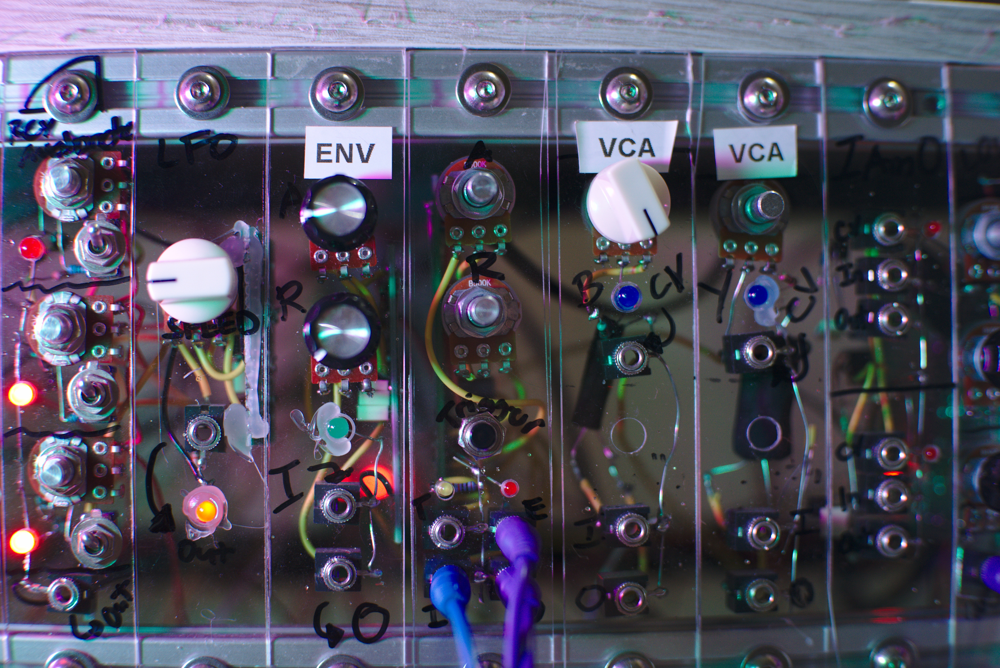

# Envelope and VCA
by Benjie Jiao

**DISCLAIMERS:** I'm new to Synth DIY and most of the time I do things by trial and error. Build this at your own risk. I recommend trying it out on breadboard first. The VCA on this build sometimes leaks some sounds if the input is loud enough, I recommend trying out other VCAs to fit into this build. 

A single synth module containing an envelope and a VCA.

### Inputs

*Trigger/Gate (T)* - Any trigger or gate

*Audio In (I)* - The audio signal to be attenuated by the envelope.

### Output

*Envelope (E)* - The envelope generated by the module.

*Audio Out (O)* - The Audio In signal attenuated by the generated Envelope.

### Controls

*Trigger* - A manual control for the trigger input. This will also generate an envelope.

## Version History

**Version 1.0**

The initial version. Click [here](https://raw.githubusercontent.com/benjiao/EnvelopeVCA/master/EnvelopeVCA%201.0.svg) for full image.

